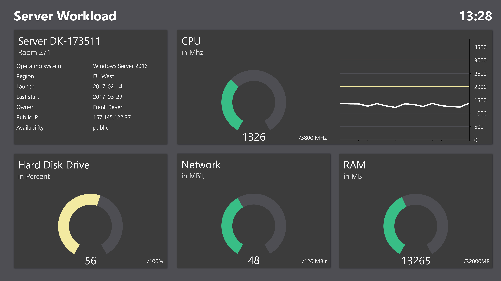

### Ⅰ. 简介

- [monitor](https://github.com/zfoo-project/zfoo/blob/main/storage/README.md) 轻量级cpu，内存，硬盘，网络监控

### Ⅱ. 使用

- uptime，仿Linux的uptime指令，可以用来监控cpu的负载
  ```
  UptimeVO uptime = OSUtils.uptime();
  ```

- df，仿Linux的df指令，可以用来监控硬盘容量
  ```
  List<DiskFileSystemVO> df = OSUtils.df();
  ```


- free，仿Linux的free指令，可以用来监控内存占用
  ```
  MemoryVO free = OSUtils.free();
  ```


- sar，仿Linux的sar指令，可以用来监控网络IO
  ```
  List<SarVO> sar = OSUtils.sar();
  ```

### Ⅲ. 传统的服务器监控

- 传统的单机服务器监控，主要看cpu，内存，硬盘，网络
  

- 分布式服务器监控，主要是监控多台服务器，和单机监控差别不大，唯一不同就是服务器变多了
  ```
  自己写一个分布式服务器监控非常简单，只需要每隔一秒钟或者一分钟去采集到当前服务器的主要数据，上传到数据库或者其他服务器上就行了。
  通过这些被采集到的数据，去分析性能，去做监控警报，做折线图或者其他可视化图表。
  monitor通过静态类封装可以轻易采集到，然后实现自己的分布式监控程序，而且可以完全内嵌在Java程序中，不需要额外的部署
  ```

### Ⅲ. 现在的服务器监控

- 现在服务器是容器的时代，服务器监控也从对服务器的监控转变为对容器的监控
- 容器监控几乎是容器自带的一个集成功能了，甚至云厂商还会免费提供监控程序和监控服务

### Ⅳ. 我们能做的服务器监控

- 自己定制的监控才是符合自己项目的监控，比如自己实现一个监控rpc接口被调用次数的这种监控
